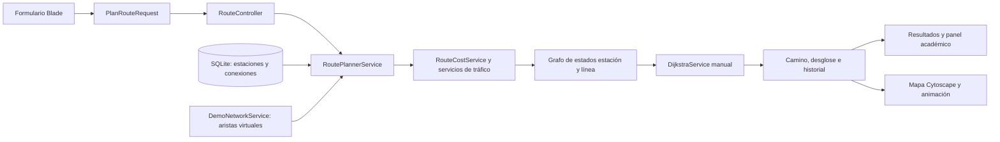
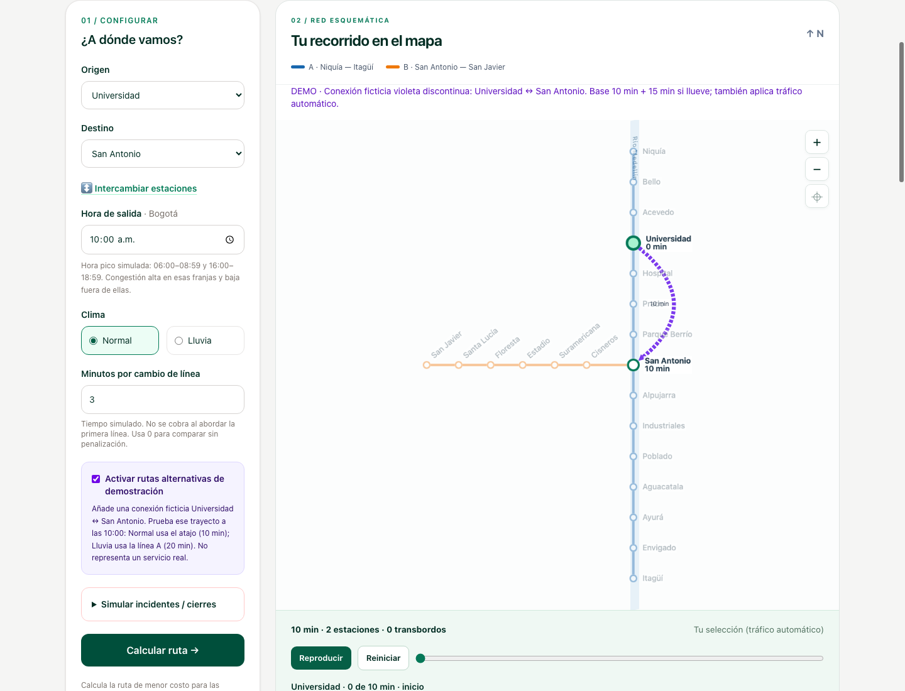
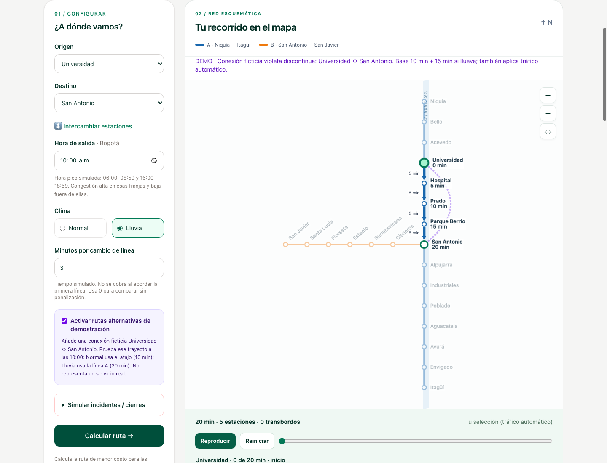
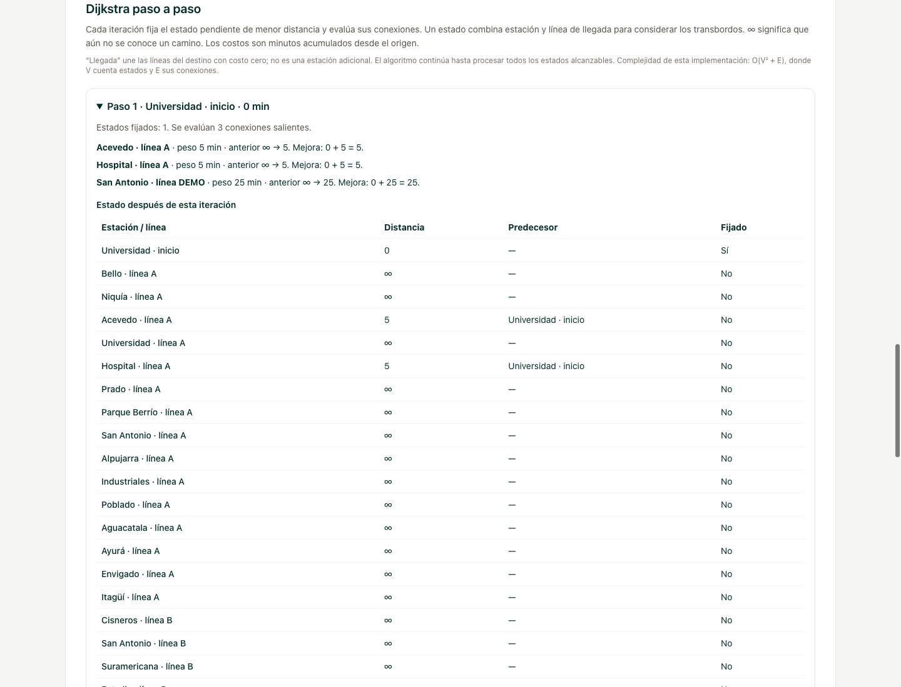
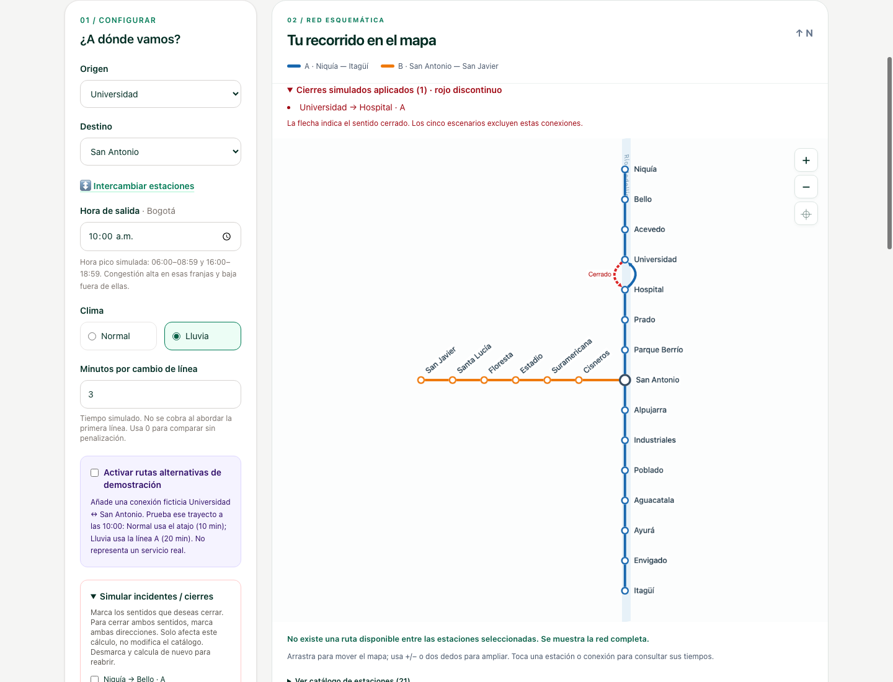

# MetroRoute Medellín — Informe académico

**Asignatura:** Análisis de Algoritmos  
**Integrantes:** Jose y Anderson  
**Fecha de revisión:** 27 de septiembre de 2026  
**Alcance:** implementación local de `dev/jose`, incluidas las funcionalidades aún sin publicar en `main`.

## Resumen y problema

MetroRoute Medellín es una aplicación web académica que calcula el recorrido de menor tiempo simulado entre estaciones de una red simplificada del Metro. El problema consiste en elegir una secuencia válida de conexiones dirigidas cuyo costo acumulado sea mínimo, considerando clima, hora pico, congestión, cambios de línea y cierres.

El objetivo no es producir tiempos operativos oficiales. La aplicación hace visibles los conceptos de vértice, arista, peso, relajación y reconstrucción del camino mediante una implementación manual de Dijkstra. El mapa y la animación ayudan a interpretar el resultado; el panel académico permite inspeccionar el cálculo.

## Objetivos

- Representar una red de transporte con un grafo dirigido y ponderado.
- Calcular pesos no negativos a partir de condiciones seleccionadas.
- Encontrar la ruta de menor costo con Dijkstra implementado manualmente.
- Explicar las iteraciones, distancias, predecesores y estados visitados.
- Demostrar cambios de ruta al variar pesos o retirar conexiones.
- Conservar evidencia verificable del trabajo y de las pruebas automatizadas.

## Arquitectura

Se utilizan Laravel y PHP para validación, servicios y persistencia; SQLite para el catálogo; Blade, JavaScript y Tailwind CSS para la interfaz; Cytoscape.js exclusivamente para dibujar y animar el grafo. Git y GitHub permiten registrar aportes y revisar integraciones.



El envío usa POST y redirección a GET. El servidor valida las entradas, calcula los escenarios y conserva temporalmente la selección y resultados en sesión. El navegador recibe los mismos costos del resultado; no ejecuta un algoritmo de caminos de Cytoscape.

Archivos principales: [RoutePlannerService](app/Services/RoutePlannerService.php), [DijkstraService](app/Services/DijkstraService.php), [RouteCostService](app/Services/RouteCostService.php), [TrafficConditionService](app/Services/TrafficConditionService.php), [RouteController](app/Http/Controllers/RouteController.php) y [metro-graph.js](resources/js/metro-graph.js).

## Modelo de datos y grafo

`Station` contiene identificador, código único y nombre. `Connection` contiene origen, destino, línea, tiempo base y penalizaciones por lluvia, hora pico, congestión y transbordo. Las claves foráneas evitan extremos inexistentes; la combinación origen, destino y línea es única. Se permiten conexiones paralelas en líneas diferentes.

El catálogo sembrado tiene **21 estaciones, 20 tramos bidireccionales y 40 aristas dirigidas**. La línea A contiene 15 estaciones y la B, 7; San Antonio se comparte y se almacena una sola vez. Cada tramo bidireccional tiene dos registros, por lo que cerrar un sentido no elimina automáticamente el contrario.

La red física base es un árbol al ignorar la orientación. Por eso, cambiar sus pesos altera el costo pero no ofrece otro camino simple. El modo DEMO añade dos aristas virtuales Universidad ↔ San Antonio, etiquetadas como ficticias. Estas conexiones no se guardan en SQLite.

### Estado necesario para los transbordos

Guardar únicamente una distancia por estación no basta cuando cambiar de línea tiene costo. Llegar a una estación por A puede ser más barato al principio, pero llegar por B puede evitar una penalización posterior.

El planificador representa cada estado como **(estación, línea de llegada)**. El estado inicial no tiene línea, así que el primer abordaje no paga transbordo. Una arista cambia al estado de la estación siguiente y su línea. Solo si la línea anterior es diferente se agrega la penalización. Un estado terminal une las llegadas al destino mediante aristas de peso cero; no representa una estación adicional del recorrido.

Ejemplo: origen → intermedia cuesta 1 por A o 3 por B; intermedia → destino cuesta 1 por B. Con transbordo de 5 minutos, A→B cuesta 7 y B→B cuesta 4. Con transbordo cero, A→B cuesta 2. La implementación conserva ambos estados de llegada y elige correctamente en los dos casos. Esta situación se verifica en [TransferRoutingTest](tests/Feature/TransferRoutingTest.php).

## Pesos dinámicos

Para una conexión y un estado de llegada:

**Peso = base + lluvia aplicada + hora pico aplicada + congestión aplicada + transbordo aplicado.**

| Componente | Regla del catálogo base |
| --- | --- |
| Base | 4 minutos por conexión A; 3 por conexión B |
| Lluvia | +1 por conexión si se selecciona Lluvia |
| Hora pico | +2 por conexión en [06:00, 09:00) o [16:00, 19:00) |
| Congestión | Penalización 1 multiplicada por 0, 1 o 2 para baja, media o alta |
| Transbordo | Formulario propone 3 minutos, configurable entre 0 y 60, solo al cambiar de línea |
| Cierre | La conexión se excluye antes de construir el grafo |

La hora es local de Bogotá. El formulario elige congestión alta en hora pico y baja fuera de ella; el servicio también admite media explícitamente. La hora de salida se mantiene fija durante todo el cálculo. Si se invoca el planificador sin configurar minutos de transbordo, usa el valor almacenado de la conexión de entrada a la nueva línea, que inicialmente es cero.

Universidad → Hospital, a las 07:30 con lluvia y sin cambio de línea, cuesta **4 + 1 + 2 + 2 + 0 = 9 minutos**. El ejemplo de 8 minutos de la consigna corresponde a aplicar una sola unidad de congestión; el modo automático implementado aplica dos en congestión alta. Todos son parámetros simulados.

Los cuatro escenarios de referencia —Normal, Lluvia, Hora pico, Lluvia + hora pico— excluyen congestión para aislar esas variables. La quinta fila usa las condiciones reales de la selección, dentro de esta simulación. Cada escenario recalcula su propio camino, con los mismos cierres, modo DEMO y tiempo por transbordo.

## Dijkstra implementado

1. Inicializar las distancias en infinito, el origen en cero y los predecesores en nulo.
2. Buscar linealmente el estado no visitado de menor distancia finita.
3. Fijar ese estado y examinar sus vecinos.
4. Calcular `candidato = distancia_actual + peso`.
5. Si el candidato es menor que la distancia conocida, actualizar distancia y predecesor: esta operación es la **relajación**.
6. Registrar la iteración después de evaluar los vecinos.
7. Repetir hasta que no queden estados alcanzables sin visitar.
8. Seguir los predecesores desde el destino hasta el origen e invertir la secuencia.

Se usan pesos no negativos, condición necesaria para la elección voraz de Dijkstra: una vez fijado el menor estado pendiente, ningún camino que pase por estados más lejanos puede reducirlo usando aristas no negativas. El código rechaza pesos inválidos y conserva el primer resultado en empates estrictos; no promete minimizar transbordos como criterio secundario.

Si el destino permanece inalcanzable, devuelve camino vacío y costo nulo; la interfaz muestra “sin ruta”, no cero minutos. El servicio procesa todos los estados alcanzables incluso después de fijar el destino, por lo que el historial puede continuar tras encontrar su costo mínimo.

### Complejidad real

Sea V el número de **estados del grafo ampliado**, no solo estaciones físicas, y E el número de transiciones entre estados. La selección lineal del mínimo requiere hasta V búsquedas de V elementos: **O(V² + E)**. No se usa una cola de prioridad.

El grafo ocupa O(V + E). Distancias, predecesores y visitados requieren O(V) adicional sin historial. Las copias de distancias y predecesores por iteración elevan el historial a **O(V² + E)**. El planificador ejecuta cinco búsquedas cuando hay una selección horaria: es un factor constante sobre la misma cota. Solo conserva historial para la ruta seleccionada.

## Demostraciones reproducibles

Usar el catálogo original; los resultados pueden variar si se modifican sus datos. Mantener 3 minutos por transbordo salvo indicación contraria.

| Caso | Configuración | Resultado esperado |
| --- | --- | --- |
| Ruta base | Universidad → San Antonio, 10:00, Normal, sin DEMO ni cierres | 16 min por A |
| Alternativa | Mismo trayecto, DEMO activo, Normal | 10 min por DEMO |
| Cambio por lluvia | DEMO activo, 10:00, Lluvia | 20 min por A; DEMO costaría 25 |
| Cierre sin alternativa | Lluvia, cerrar Universidad → Hospital, DEMO apagado | Sin ruta |
| Cierre con alternativa | Mismo cierre, DEMO activo | 25 min por DEMO |
| Reapertura | Desmarcar cierre, mantener DEMO y Lluvia | 20 min por A |
| Tráfico y transbordo | Niquía → San Javier, 07:30, Lluvia, sin DEMO ni cierres | 114 min, 14 estaciones, 1 transbordo |
| Fuera de hora pico | Mismo viaje a las 10:00 | 62 min |

En el viaje de 114 minutos, el desglose es **46 base + 13 lluvia + 26 hora pico + 26 congestión + 3 transbordo**. Sus cuatro referencias dan 49, 62, 75 y 88 minutos.

## Evidencias visuales

Capturas de la aplicación local obtenidas para esta entrega. Son evidencia de los casos mostrados, no de una revisión exhaustiva de todos los dispositivos.









## Validación automatizada

En la revisión funcional previa de este estado local pasaron **158 pruebas PHP y 7 pruebas JavaScript del mapa**; la compilación de Vite terminó correctamente. El aviso opcional de `fontaine` se refiere a optimización de fuentes y no impidió compilar. Estos resultados no equivalen a pruebas visuales exhaustivas ni a benchmarks de rendimiento.

```bash
php artisan test --compact
npm run test:map
npm run build
```

La cobertura incluye pesos, límites horarios, caminos mínimos, reconstrucción, rutas inexistentes, conexiones paralelas, cambios de ruta por clima, transbordos que alteran el camino óptimo, cierres dirigidos, reapertura, validación HTTP y correspondencia entre mapa y resultados. Véanse [tests](tests), especialmente [DijkstraServiceTest](tests/Unit/Services/DijkstraServiceTest.php), [DemoRoutesTest](tests/Feature/DemoRoutesTest.php) y [ConnectionClosuresTest](tests/Feature/ConnectionClosuresTest.php).

## Trabajo colaborativo y trazabilidad

La consigna repartió configuración, catálogo, pesos, formulario y resultados a Jose; Dijkstra, historial, tráfico, mapa y modo académico a Anderson. Durante el desarrollo, Jose asumió integración visual y los bloques finales, con autorización expresa al no poder continuar Anderson. Esta descripción diferencia el reparto inicial del trabajo efectivamente integrado; no sustituye el historial Git.

La revisión local del historial muestra, entre otros, `668cb1d` (Anderson, integración de tráfico y Dijkstra) y `bef919a` (Jose Ricardo Quiros, mapa y animación). Los cambios posteriores de DEMO, transbordos, panel, cierres y estos documentos siguen locales al preparar este informe. Deben registrarse con commits separados por funcionalidad y la identidad real de quien los realizó, sin reescribir autores. Las ramas personales `dev/jose` y `dev/anderson` sustituyeron por acuerdo posterior el planteamiento inicial de una rama por funcionalidad.

## Limitaciones y conclusión

La red es una simplificación de 21 estaciones, no el mapa completo. Los pesos, horarios y la conexión DEMO son simulados; no hay datos de tráfico en vivo ni tiempos oficiales. No se simula la evolución del tráfico, días festivos, espera de trenes o capacidad. Los cierres son por consulta y sentido; no existe un registro persistente de incidentes ni un estado manual “congestionada” por conexión. El historial detallado es adecuado para este catálogo pequeño y puede requerir reducción en redes grandes.

El sistema permite observar cómo una función de costo y la disponibilidad de las aristas determinan el camino mínimo. La expansión por línea mantiene correcta la optimización con transbordos, mientras que DEMO hace visible un cambio de ruta que la topología base no permitiría demostrar. La publicación en `main` y la preparación individual de la exposición continúan como pasos de entrega.

## Fuentes del informe

Este informe se fundamenta en la consigna inicial proporcionada por el usuario y el código y pruebas enlazados del repositorio. No presenta cifras de operación del Metro ni atribuye sus datos simulados a fuentes oficiales. La matriz de [cumplimiento](REVISION_REQUISITOS.md) contiene la trazabilidad de la consigna.
